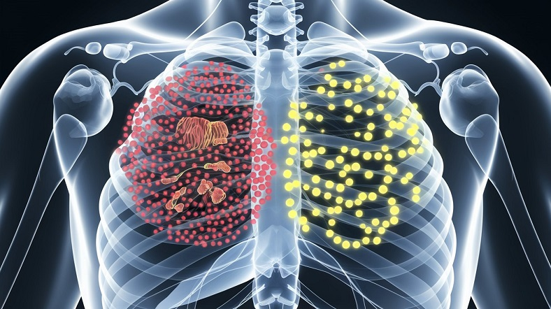

# Tuberculossis prediction using Deep Learning

 

## Introduction

This project uses Convolutional Neural Networks (CNNs) and Transfer Learning with the VGG19 model to detect Tuberculosis (TB) from chest X-ray images. Initially, a custom CNN is trained, achieving 93% accuracy, and then transfer learning is applied to improve performance. This automated approach enhances TB detection efficiency, providing valuable support in clinical diagnostics.

## Dataset

The dataset consists of 3,000 chest X-ray images of normal cases and 750 images of patients affected by Tuberculosis. The data is balanced using augmentation techniques to ensure the model learns effectively from both categories, improving its ability to distinguish between healthy and affected individuals.

### Dataset Statistics:

Here is sample statistics of the data.

- **Name:** TB_Chest_Radiography_Database
- **Mode:** Image Data
- **Number of Samples:** 
  - Train: 4,502  
  - Test: 400
- **Type:** Binary Classification
- **Number of Classes:** 2
- **Classes Name:** 
  - Normal: 0
  - Tuberculosis: 1

## Pre-processing

The preprocessing steps of the proposed project are the following:
<list of preprocessing steps>

1. Balance both classes using Data Augmentation 

## Models

For the Tuberculosis prediction following models are trained with the tuned hyperparameters:

- **Convolutional Neural Network**
  - The custom CNN model consists of four convolutional layers with filters increasing from 16 to 128, each followed by MaxPooling to reduce spatial dimensions. The ReLU activation function is applied after each convolution to introduce non-linearity. After the final convolution, the output is flattened to feed into a fully connected layer for classification.

- **Fully Connected Layer**
  - The model includes six dense layers, starting with 256 units and gradually reducing to 8 units, each activated by ReLU. Batch normalization is applied after each layer to stabilize training, and Dropout (0.2) is used for regularization to prevent overfitting. The final output layer uses a sigmoid activation to produce a binary classification for Tuberculosis detection.

  **VGG19**
  - The model leverages VGG19 as a pretrained convolutional base, with its parameters frozen to retain learned features. After flattening the output of the VGG19 layers, three fully connected layers with 32, 16, and 8 units are added, all using ReLU activation. The final output layer uses a sigmoid activation for binary classification. Only the parameters of the fully connected layers are trained, while the CNN layers from VGG19 remain fixed.

## Results

| Metrics    | CNN   | Transfer Learning (VGG19) |
|------------|-------|---------------------------|
| Accuracy   | 0.940 | 0.9950                    |
| Precision  | 0.935 | 0.990                     |
| Recall     | 0.935 | 0.990                     |
| F1-Score   | 0.935 | 0.990                     |

## Dependencies

- **NumPy version: 1.26.4**: For numerical operations.
- **Pandas version: 2.2.2**: For data manipulation and analysis.
- **Scikit-learn version: 1.4.2**: For machine learning tools.
- **Matplotlib version: 3.8.4**: For data visualization.
- **Seaborn version: 0.13.2**: For data visualization.
- **Tensorflow Version: 2.17.0**: For Artificial Neural Netrowk.

